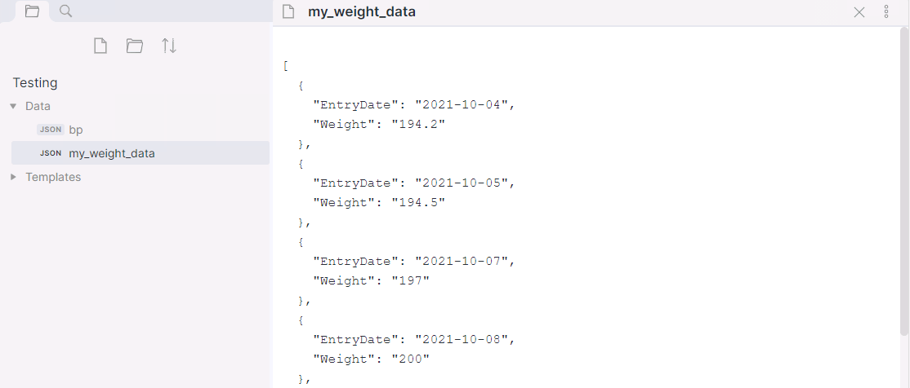
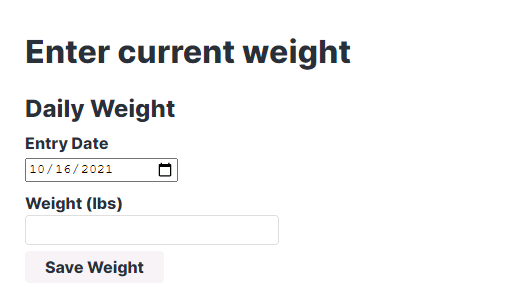
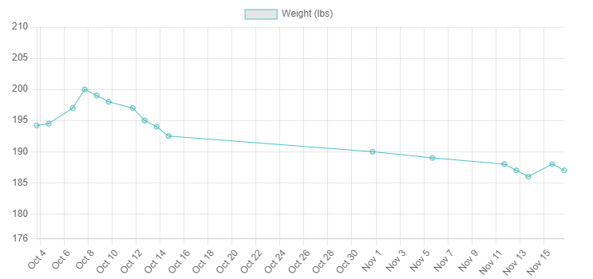
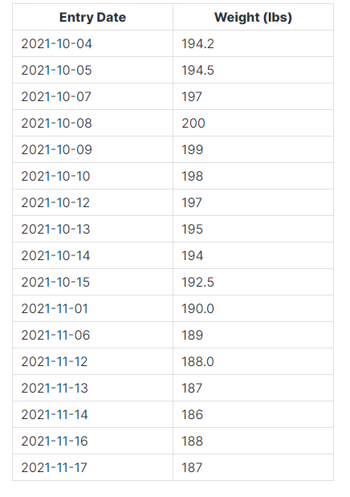

## Obsidian Data Collection Plugin
WARNING - This plugin is currently in a beta state.  Use with caution.

This Obsidian plugin allows for the creation and population of json data files.  


### How to use
- Clone this repo.
- `npm i` or `yarn` to install dependencies
- `npm run dev` to start compilation in watch mode.

### Manually installing the plugin

- Copy over `main.js`, `styles.css`, `manifest.json` to your vault `VaultFolder/.obsidian/plugins/obsidian-data-collection/`.

### Viewing JSON Files

The plugin registers an extension and viewer for .json files.




### Configure Data Collection Form

The following example is designed to collect a daily weight measurement and add it to the my_weight_data.json file in the data folder.  YAML format is used to specify the form.

	```datacollection-form
	title: Daily Weight
	source: Data/my_weight_data.json
	buttonText: Save Weight
	fields:
	- type: date
	  name: EntryDate
	  displayName: Entry Date
	  defaultValue: today
	- type: double
	  name: Weight
	  displayName: Weight (lbs)
	  defaultValue: 0
	```

Here is a view of the form that is created.



#### Form Level Settings
* title - (optional) - The form's title
* source - The json file to save data into
* buttonText - (optional) Text on the save button.
* requiredFieldMessage - (optional)  Message to display when a field is not populated.
* recordSavedMessage - (optional) Message to display on save.
* sortOnSave - (optional) Indicates if the array should be sorted on save.
  * sortFieldName - Field to sort the array on
  * sortDirection - asc or desc
* fields - List of fields to collect data on.

Note - Sorting on every save will may cause performance issues

#### Form Field Settings
* type - Type of field
* name - Field name to store in the JSON file
* displayName - Field name to display
* defaultValue - Value to set when the form loads
* required - (Optional) Indicates if the field is required.  Defaults to false.  If required is set then an asterisk is added to the display name.

I am using using these forms with the [Force note view mode](https://github.com/bwydoogh/obsidian-force-view-mode-of-note) plugin.

The following is an example of the JSON data file that is created by the form.

	[
	  {
		"EntryDate": "2021-10-04",
		"Weight": "194.2"
	  },
	  {
		"EntryDate": "2021-10-05",
		"Weight": "194.5"
	  },
	  {
		"EntryDate": "2021-10-07",
		"Weight": "197"
	  },
	  {
		"EntryDate": "2021-10-08",
		"Weight": "200"
	  },
	  {
		"EntryDate": "2021-10-09",
		"Weight": "199"
	  },
	  {
		"EntryDate": "2021-10-10",
		"Weight": "198"
	  }
	]


### Configure a Graph

The following example creates a graph from the data in the my_weight_data.json file.  YAML formatted information is used to specify the graph.

NOTE - Only two data sets are currently supported (X, Y)

	```datacollection-graph
	title: Weight over month
	source: Data/my_weight_data.json
	type: timeseries
	fields:
	- type: date
	  name: EntryDate
	  axis: x
	  displayName: Entry Date
	- type: double
	  name: Weight
	  axis: y
	  displayName: Weight (lbs)
	  dataColor: rgb(75, 192, 192)
	```

Chart Type Options that are currently supported.
* bar
* line
* scatter
* timeseries

Here is an example of the chart that is generated.




### Configure a Table

The following example creates a table from the data in the my_weight_data.json file.  YAML formatted information is used to specify the format of the table.

	```datacollection-table
	title: Weight entries
	source: Data/my_weight_data.json
	fields:
	- type: date
	  name: EntryDate
	  displayName: Entry Date
	  headerStyle: "text-align: center;width:200px;"
	  fieldStyle: "text-align: left;"
	- type: double
	  name: Weight
	  displayName: Weight (lbs)
	  headerStyle: "text-align: center;width:200px;"
	  fieldStyle: "text-align: left;"
	```
Here is an example of the chart that is generated.

